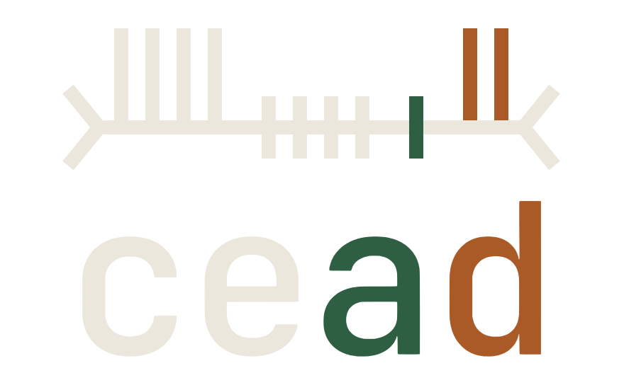

  <picture>
    <source media="(prefers-color-scheme: light)" srcset="assets/lockup-light.svg">
    
  </picture> 
  <em>cead</em> (Irish: permission; "kyad")

cead is an agent harness built as a confidential microVM: a userspace for a model, over a kernel that enforces and witnesses, whose evidence does not depend on who owns the hardware.
The model gets a Linux machine of its own and a shell to drive it: the kernel permits each command, and eBPF witnesses it.

## What cead is

A pinned Linux kernel in a confidential microVM.
The model gets a system prompt and a shell, as in any agent harness.
Every command it writes runs as a Linux process under the kernel's own controls: seccomp, Landlock and cgroups.
An eBPF program in the kernel records what each process did, in a place the model's processes cannot reach.

Most agent harnesses state their limits in prompt text and application code, then say what happened from inside the process that did it.
cead has the kernel enforce the limits and the kernel write the record, so the record does not depend on the model or the harness telling the truth.

Nor does it depend on the host.
The processor attests what booted, and the machine signs its record with a key the host cannot read.
The host can stop a job, but cannot read it or forge its record.
On hardware without attestation, the same machine runs unattested and says so.

Harness design is memory-management policy.
The context window is a cache; the model's state lives in the machine, in files, and the model reaches it through the shell.
A script that stands up a service, runs forty commands and prints `ok` has advanced the task by forty commands and cost the context window one line.
All forty ran under kernel policy and were recorded, whether or not the model mentioned them.

Three interfaces; everything between two lines is swappable.

| Line | Interface |
|---|---|
| VMM ↔ machine | measured boot, content-addressed disks, attestation; devices are untrusted input |
| kernel ↔ commands | Linux syscall ABI |
| commands ↔ model | POSIX sh, GNU flags and error text |

System diagram to come with the first release.

### Reading

- [Recursive Language Models](https://arxiv.org/abs/2512.24601) (Zhang, Kraska, Khattab)
- [Language model harnesses are compositional generalizers](https://alexzhang13.github.io/blog/2026/harness/) (Zhang, Khattab)
- [OSTEP](https://pages.cs.wisc.edu/~remzi/OSTEP/) (Arpaci-Dusseau)
- [Capability Myths Demolished](https://srl.cs.jhu.edu/pubs/SRL2003-02.pdf) (Miller, Yee, Shapiro)
- [Robust Composition](http://www.erights.org/talks/thesis/) (Miller)
- [Prime Agent](https://www.primeintellect.ai/blog/prime-agent) ([source](https://github.com/PrimeIntellect-ai/prime-agent)) and [Sandboxes](https://www.primeintellect.ai/blog/sandboxes) (Prime Intellect)

## What cead is not

- Not a container runtime.
  cead uses container images and container schedulers, and replaces the container itself with a microVM.
- Not a conversation.
  Nothing carries between jobs except state in the machine.
  A job's context window is the system prompt, the query, and what the model has read since.
- Not a policy.
  You bring your own, written in Cedar, and cead compiles it into kernel rules; cead does not decide what a model should be allowed to do.
- Not a new interface for the model.
  The model gets a POSIX shell with GNU tools, because that is the interface with the most training data behind it and the one the kernel already enforces.
  A bespoke tool schema is out of distribution, has to be taught in every prompt, and needs a translation layer between what the model said and what was enforced.

## How to use cead

Install instructions come with the first release.

A manifest is one file that names a machine: kernel, task image, policy, VMM, and the model: its weights and engine.
Two ways to run it:

- `cead` boots the machine the manifest describes and opens a shell over it.
  Each command in that shell is one operator verb; `run` starts the model.
- `cead run` does one run from your own shell and returns.
  argv is the query, stdin is the context, stdout is the answer, and the exit code is the outcome.

A query is the length of a commit message; anything longer is a file in the machine for the model to read.

What a job does, from manifest to first command:

1. The VMM boots one kernel and attaches two read-only disks: the core (cead's tools, policy and eBPF programs, built by nix) and the task image.
2. init runs as root, before any model process exists.
   It loads the eBPF programs into the kernel and compiles the policy into a seccomp filter and a Landlock ruleset.
3. init mounts one filesystem: the task image as root, the core first on PATH, and each descriptor (context on stdin, checkout, scratch, database file).
4. The harness forks the root process, attaches the policy, drops to an unprivileged uid, and execs the shell.
   Every child inherits the policy; no process can remove it.
5. The harness renders the system prompt from what it mounted, so it cannot claim what is not there, and sends it with the query to the engine.
6. The model writes its first command.

Three kinds of file, three fates:

| File | Consumed by | Becomes | The model's relation to it |
|---|---|---|---|
| eBPF program | init, via `bpf()` | a kernel object | needs CAP_BPF to touch; has none |
| policy | init, via seccomp and Landlock | attributes of every process | no syscall loosens them |
| context, checkout, database | mount and descriptor | files in the view, with rights | reads and writes within them |

Example run and screen recording to come with the first release.

## Dependencies

| Layer | Stack |
|---|---|
| language | Rust |
| kernel | Linux: cgroup v2, seccomp, Landlock, vsock; eBPF via aya |
| shell and tools | brush, uutils, SQLite |
| policy | Cedar |
| VMMs | Cloud Hypervisor (SEV-SNP on KVM); Firecracker and Virtualization.framework, unattested |
| images and build | OCI images, nix |

## Deployment

The machine runs wherever the cead CLI runs: a laptop or a cloud VM with a hypervisor.
The model runs wherever the manifest's engine is: a hosted API or a local server.
The CLI drives everything below: it reads the manifest, boots, runs, snapshots, forks, and reads the log.

The machine is the unit of scale.
Work fans out three ways, told apart by who spawns and when:

| Use | Who spawns | When | Mechanism |
|---|---|---|---|
| evals | operator | before the job | scale-out: N machines from one manifest |
| reinforcement learning | operator or trainer | mid-job, at a chosen state | fork: K machines from one snapshot, the way a git worktree forks a checkout |
| long or autonomous tasks | the model | whenever it decides | `rlm`: a sub-agent process inside the machine |

- Kubernetes can schedule machines as pods; Firecracker was built for this shape of workload.
- The long-term direction is one box: model, inference engine, kernel and cead.

### Identity

- The machine is the boundary.
  Everything a job can touch is inside one disposable microVM, so the questions that usually need users, roles and sessions collapse to one: which machine.
- A manifest answers it by hash.
  Two machines with the same manifest are the same experiment.
- Operator and model are told apart by where they stand.
  The operator runs the CLI on the host; the model runs inside the machine as an unprivileged user.
- Access is granted; content is discovered.
  Every file, socket or database the model can reach was granted to it by cead, and a child process gets no more than its parent held.
  What is in them, the model finds for itself.
- Authority is per tool: how far a tool can go beyond what its command line says.
  `grep` does only what its arguments say; `python` can do anything the process may.
  The class picks the tool's kernel policy and says how to read its trace.
- The host is out of reach, and untrusted.
  The grader and long-lived API keys stay on the host; the machine holds only a token scoped to its job, and the log is held outside the machine.
  The host is trusted only to keep a job running: it can stop one, but not read it or forge its log.
  Trusted-host mode asserts the rest instead of proving it.

### Hardware

Cloud Hypervisor boots attested machines on bare-metal AMD EPYC with SEV-SNP, and the same machine unattested on any KVM host.
Firecracker and Virtualization.framework boot it unattested, so the harness runs where developers are.

### Network

The model's processes have no network.
The machine reaches the host over vsock only.
The host relays inference, encrypted between the harness and the engine, and the machine's messages to the log.
Rules beyond that come with the first release.

### Workloads

- Build time.
  A task's tools are packed into a read-only OCI image; a SWE-bench instance image works as is.
- Each call.
  The harness assembles the context window from the system prompt, the query and the bounded output of every command so far, and sends it to the engine.
  It runs the command that comes back and adds the output, cut at a size cap, to the window; the full output goes to a file the model can read piecewise.
- Recursion, inside the machine.
  `rlm` starts a child process with a slice of the parent's context, a meter under its parent's, the same tools, and its own context window.
  It is a sub-agent, built from process structure rather than at the application layer.
- Forking, of the machine.
  A snapshot of a running machine boots another machine that diverges from the same state.
- Finish.
  `finish` ends a process with its answer; when the root process finishes, the job is over and the machine is gone.

### Data

- State is files in the machine, reached through the shell.
- The database is a file.
  SQLite is a core tool, so a relational database is a file in the filesystem and a snapshot captures it.
- Postgres is a task tool for tasks that need extensions, concurrency or an existing data directory.
  It runs inside the machine, so a snapshot still captures it.
- State leaves the machine on purpose.
  A job's answer is stdout; a checkout can be pushed; a snapshot can be exported.
  Nothing else leaves.

### Observability

- eBPF records what the model's processes do: which programs they start, which files they read, and each request to the engine.
- Every action has a cause.
  The tracer is keyed by cgroup, so each action is attributed to the command that caused it, however many processes that command spawned.
- The log is one audit record per call, held outside the machine.
  The operator reads it from the CLI, live during a job and after.
- Cost per call is a first-release measurement.
